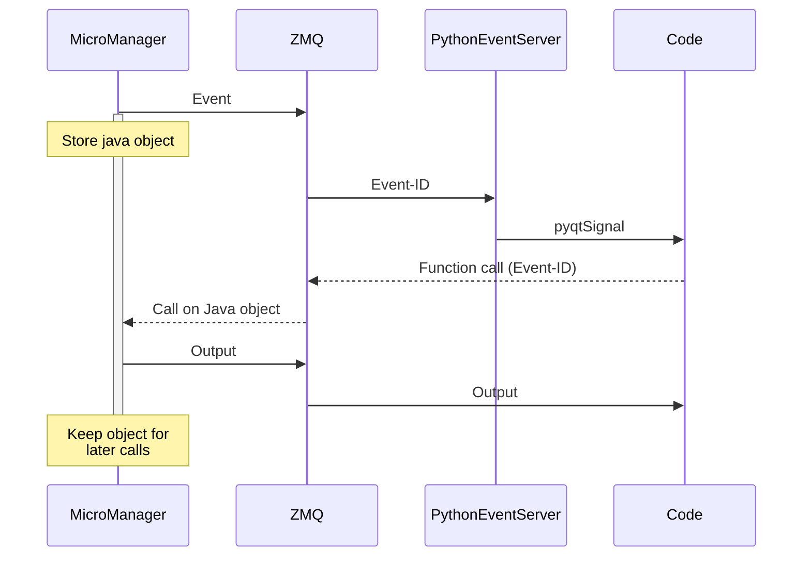

# pymm-eventserver
Event Server to receive Micro-Manager events in python via zeromq

This module functions as a plugin for Micro-Manager and takes a lot of inspiration and some
functionality from PycroManager (https://pycro-manager.readthedocs.io/en/latest/index.html)

The server follows the logic of Pycromanager:

Install using pip
```
pip install pymm_eventserver
python
>>> import pymm_eventserver.setup
>>> pymm_eventserver.setup.install_java_server()
```




The exception are events that contain image data. As keeping those object in memory on the java
side will lead to pretty heavy memory usage in the ImageJ heap space pretty quickly. So these are
sent directly over the zeromq bus. If they are not received correctly, the image data will be lost.